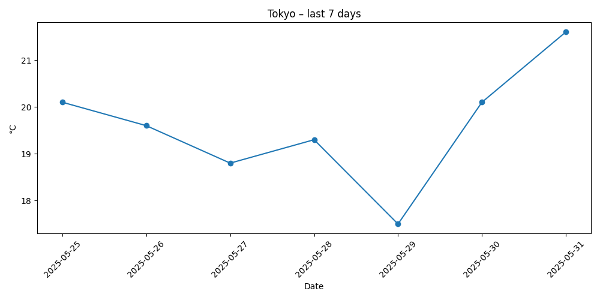
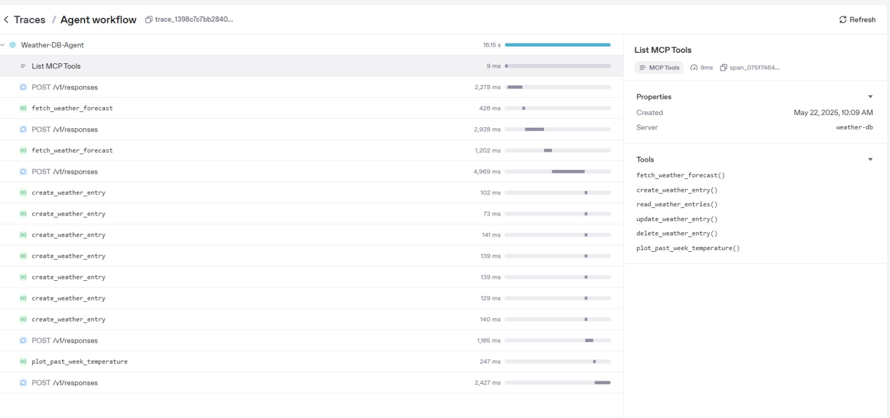

# מנפלאות הבינה המלאכותית קב' 01 - 101475201

This project demonstrates an AI agent that fetches weather forecasts, stores them in a database, and generates temperature plots.

## Setup

1. **Clone the repository**
2. **Install dependencies**:
   ```powershell
   pip install -r requirements.txt
   ```
3. **Copy and edit environment variables**:
   ```powershell
   copy template.env .env
   ```
   Fill in your OpenAI API key in `.env`.


## Usage

- Run the agent:
  ```powershell
  python agent.py
  ```

## Output Example

The following plot is an example output generated by the agent for Tokyo's last 7 days:



## Agent Trace Example

Below is an example of the agent's workflow trace from the OpenAI platform:



## Files

- `agent.py`: Runs the agent and interacts with the weather server.
- `server.py`: Provides weather data tools via FastMCP.
- `template.env`: Example environment variables.
- `requirements.txt`: Python dependencies.

## Notes

- Use `template.env` as a reference for required environment variables.
